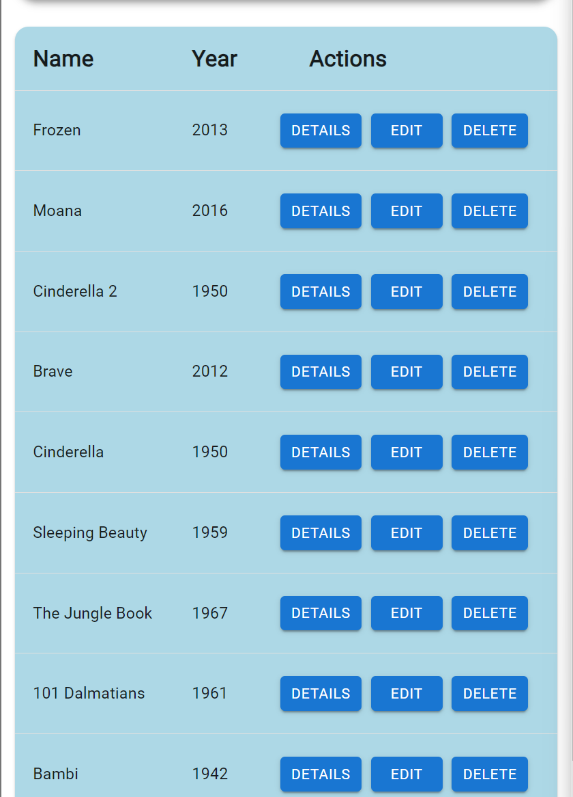
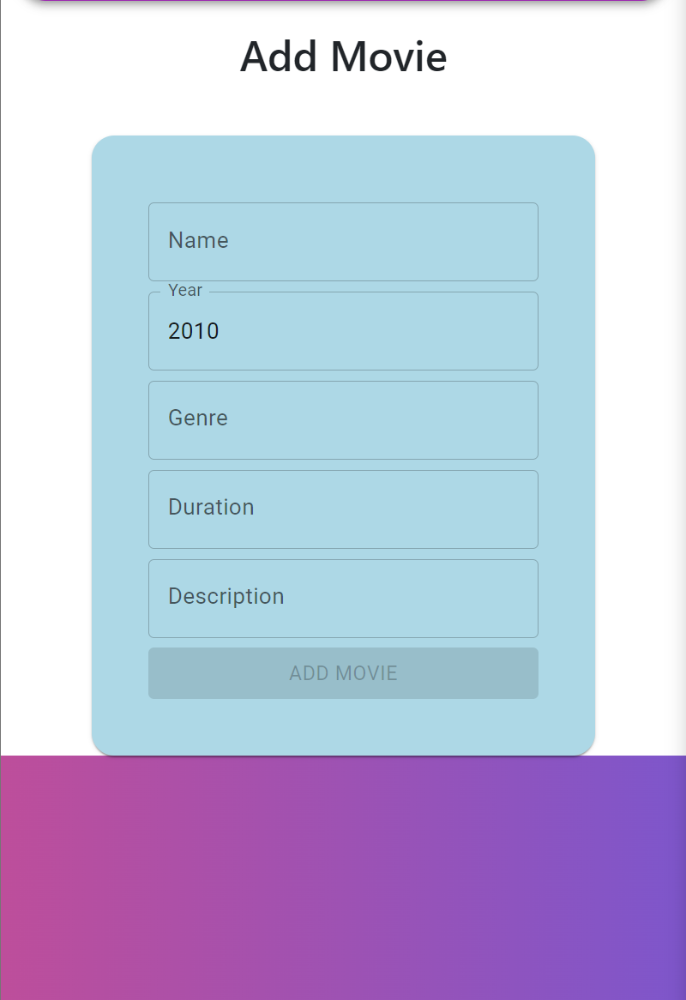
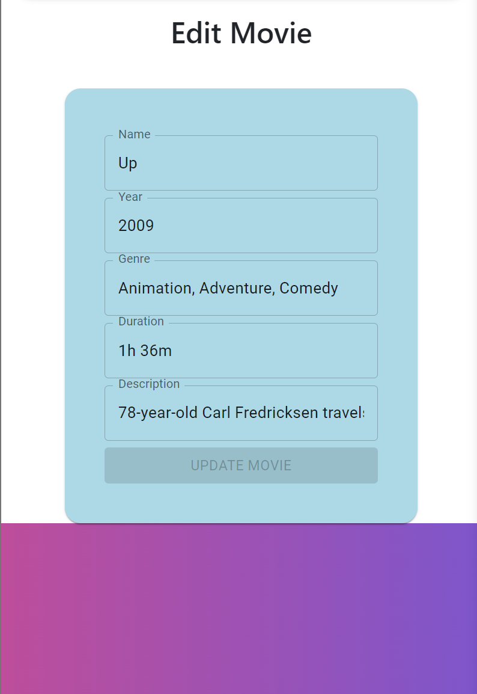

# Animated Movies App

## Project Idea

**Description:**
This app is designed to help users store and manage information about animated movies. Users can add details such as the movie title, release date, director, genre, and a brief synopsis. The app will provide an easy-to-use interface for users to browse, search, and update their movie collection. It aims to be a comprehensive database for animated movie enthusiasts, allowing them to keep track of their favorite films and discover new ones.

## Domain Details

**Entities:**

1. **Movie**
   - **Name**: The name of the animated movie.
   - **Release Date**: The date when the movie was released.
   - **Genre**: The category or type of the movie (e.g., comedy, adventure, fantasy).
   - **Description**: A brief summary of the movie's plot.
   - **Duration**: The length of the movie in minutes.

## CRUD Operations

**Create:**
- **Operation**: Add a new movie to the database.
- **Details**: Users can input the movie's title, release date, director, genre, synopsis, rating, and duration. The app will validate the data and store it in the database.

**Read:**
- **Operation**: View details of a specific movie or list all movies.
- **Details**: Users can search for movies by title, genre, or director. The app will display the movie details, including the synopsis and rating.

**Update:**
- **Operation**: Edit the details of an existing movie.
- **Details**: Users can update any field of a movie's information. The app will validate the changes and update the database accordingly.

**Delete:**
- **Operation**: Remove a movie from the database.
- **Details**: Users can delete a movie by selecting it from the list. The app will confirm the deletion before removing the movie from the database.

## Persistence Details

**Local Database:**
- **Operations**: Create, Read, Update, Delete
- **Details**: All CRUD operations will be supported locally to ensure the app works offline. Changes will be stored in a local database (e.g., SQLite).

**Server Database:**
- **Operations**: Create, Read, Update, Delete
- **Details**: When online, the app will sync changes with a remote server to ensure data is backed up and accessible from multiple devices.

## Offline Access

**Create:**
- **Scenario**: Users can add new movies while offline. The app will store the data locally and sync with the server once the device is back online.

**Read:**
- **Scenario**: Users can view and search for movies in their local database even when offline.

**Update:**
- **Scenario**: Users can update movie details offline. The changes will be saved locally and synced with the server when the device reconnects to the internet.

**Delete:**
- **Scenario**: Users can delete movies while offline. The app will remove the movie from the local database and update the server once back online.

## App Mockup

To visualize the app, you can use tools like Figma or Sketch. Here are the essential screens:

1. **Movie List Screen**: Displays a list of all animated movies with options to search and filter.
- 
2. **Add/Edit Movie Screen**: A form where users can input or update movie details.
- 
- 
